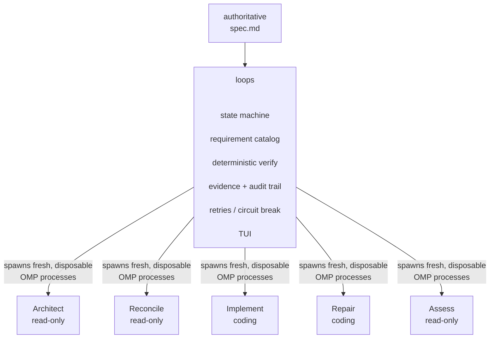

# loops

**Give it a spec. Walk away. Come back to a repository that satisfies it — verified by machines, not by an agent's word.**

`loops` is a small, obsessively deterministic Rust controller for autonomous, spec-driven development. It doesn't chat with you. It doesn't hold a single sprawling agent conversation and hope the context window forgives it. It runs a state machine that repeatedly reads your repository, decides the one next thing worth doing, hands that — and only that — to a disposable coding-agent worker, checks the result with real build/test commands, and refuses to call anything "done" until an independent, skeptical worker agrees from scratch.

The default engine behind every worker is **[Oh My Pi (OMP)](https://github.com/can1357/oh-my-pi)**, driven headlessly through `omp --mode rpc`.

> **`loops` is the orchestrator. OMP is the muscle.** Everything that matters about correctness, memory, and control lives in the Rust controller — not in the model.

---

## The idea in one picture



There is no permanent "master LLM" carrying the whole run in its head. State survives between workers the boring, reliable way: the repository itself, `spec.md`, `.loops/` state, work-unit summaries, and deterministic verification evidence. Every worker starts cold and leaves nothing but files behind.

---

## Why this has legs

Most "autonomous coding agent" demos are one long conversation wearing a trench coat. They work beautifully for five minutes and then rot: context bloats, the model forgets its own earlier decisions, and "I ran the tests and they pass" becomes something you have to take on faith. `loops` is a bet against that failure mode, built on a handful of unfashionable but load-bearing ideas:

- **Disposable context, durable state.** Every role — Architect, Reconcile, Implement, Repair, Assess — runs in a brand-new OMP process with `--no-session`. Nothing leaks between them except what the controller deliberately writes to disk. No conversation to derail, no context window to exhaust, no "wait, why did it do that three turns ago."
- **Agents propose, code decides.** An LLM saying "tests pass" is a hypothesis, not evidence. `loops` runs `cargo test`, `go test`, `pytest`, `npm run lint` — actual processes with actual exit codes — and only those decide whether a work unit is real.
- **Reconcile against reality, not against a todo list.** After every change, a fresh worker re-inspects the live repository against the full requirement catalog. Task lists lie by omission; source code doesn't.
- **Skepticism at the finish line.** Completion isn't self-certified. A final **Assess** worker — with none of the Implement/Repair conversation, only read-only tools and the requirement catalog — has to independently agree the spec is satisfied before the run is allowed to end.
- **Fail closed.** Invalid structured output, a worker touching a protected file, stagnating on the same work unit, exhausting repair attempts — all of it blocks the run instead of quietly limping forward.

None of this requires a smarter model. It requires an orchestrator with better discipline than the model it's driving — which is exactly the gap a Rust state machine is good at filling.

---

## What actually happens, step by step

A `loops run` is a hierarchy of loops, not a linear script:

```text
spec.md
   │
   ▼
ARCHITECT                 only when the requirement catalog is missing/stale
   │
   ▼
┌──────────────────── PROJECT LOOP ─────────────────────┐
│  RECONCILE                                            │
│      ├── gaps ──► IMPLEMENT ──► VERIFY                │
│      │                            ├─ PASS ─────┐      │
│      │                            └─ FAIL      │      │
│      │                                │        │      │
│      │                             REPAIR       │      │
│      │                                │        │      │
│      │                             VERIFY       │      │
│      │                                │        │      │
│      └────────────────────────────────┴────────┘      │
│              next cycle → RECONCILE the repo again    │
└─────────────────────────────────────────────────────────┘
   │ reconciliation says complete
   ▼
FINAL DETERMINISTIC GATES
   │  ├── fail ──► REPAIR ──► verify again
   ▼
ASSESS                     fresh, independent, skeptical worker
   │  ├── gaps ──► back into the PROJECT LOOP
   ▼
DONE
```

### The five roles

| Role          | Purpose                                                                    | Repo access     | Runs when                                       |
| ------------- | -------------------------------------------------------------------------- | --------------- | ----------------------------------------------- |
| **Architect** | Turns `spec.md` prose into a stable `REQ-NNN` requirement catalog          | Read-only       | Once, and again if `spec.md`'s hash changes     |
| **Reconcile** | Compares the real repo against every requirement, picks the next work unit | Read-only       | Start of every project cycle                    |
| **Implement** | Implements exactly one work unit                                           | Read/write/bash | Once per selected work unit                     |
| **Repair**    | Fixes a deterministic verification failure                                 | Read/write/bash | Only after verification fails                   |
| **Assess**    | Independently re-verifies completion from scratch                          | Read-only       | Only after Reconcile and final gates say "done" |

These are not nested OMP subagents — they are separate OS processes. Each worker receives:

```text
fresh OMP worker
    + role prompt
    + controlled skills
    + work-unit context
    + repository
```

OMP remains the execution backend; the Rust controller remains the deterministic state-machine orchestrator. Workers run **sequentially**, each with tools scoped to its role, none aware of the others or the TUI.

## Worker Skills

Workers previously used `--no-skills` because inherited OMP skills could vary by machine and quietly change worker behavior. Loops now creates an isolated per-worker skill environment under `.loops/runtime/<run>/<role>/skills` and mounts only an explicit allow-list. `--no-extensions` and `--no-rules` remain enabled.

Loops is intentionally language-agnostic. It ships only these role-procedure skills:

| Role                 | Built-in skill    |
| -------------------- | ----------------- |
| Architect, Reconcile | `spec-analysis`   |
| Implement            | `implementation`  |
| Repair               | `debugging`       |
| Assess               | `spec-assessment` |

`code-review` is also shipped for a future Review worker, but the current state machine does not add that role.

A **role prompt** states worker identity, scope, protected files, and the `loops_yield` contract. A **built-in skill** describes how that role should work. **User skills** carry project, company, framework, domain, and language expertise. A **work unit** supplies the concrete task; the repository supplies current state.

Configure user skills explicitly, relative to the project root:

```toml
[skills]
shared = [
  ".loops/skills/project"
]

[skills.roles]
implement = [
  ".loops/skills/rust"
]

repair = [
  ".loops/skills/rust"
]

review = [
  ".loops/skills/security"
]
```

Every worker receives its built-in role skill, then `shared`, then its configured role-specific paths. Unconfigured global OMP skills, project OMP skills, skills from other ecosystems, extensions, rules, and MCP-provided capabilities are never discovered or inherited. Invalid configured paths fail before the worker starts.

Loops does not know what a “Rust skill” is. It mounts `.loops/skills/rust` only because the user explicitly assigned that path to a role. Deterministic verification remains language-aware—`Cargo.toml` can select Cargo checks, `pyproject.toml` Python checks, and `package.json` Node checks—but verification detection never selects worker skills.

### Structured output, not prose-scraping

`loops` never asks a model to print a JSON code fence and prays a regex finds it. Every worker gets a host-owned RPC tool, `loops_yield`, backed by a role-specific JSON Schema (`ArchitectOutput`, `ReconcileResult`, `WorkerSummary`, …). The worker's turn isn't "done" until it calls that tool with output the controller can deserialize and validate; two structured-completion reminders are given before a non-yielding worker is treated as a failure.

### Verification is real, and it's fail-fast

`loops verify` (and every internal gate) auto-detects your stack and runs the boring commands that actually catch regressions:

```bash
# Rust
cargo build && cargo fmt --check && cargo clippy --all-targets --all-features -- -D warnings && cargo test --all-targets
# Go
go test ./...
# Python (when tests/ + project markers exist)
python -m pytest -q
# Node (whichever scripts exist, respecting your lockfile)
test / typecheck / lint / build
# Git
git diff --check
```

Add your own hard gates in `.loops/config.toml`:

```toml
[verification]
commands = ["cargo test --all-features", "./scripts/acceptance.sh"]
```

Every attempt — pass or fail — is written to `.loops/evidence/` as an auditable report (command, exit code, stdout, stderr).

### Repair doesn't argue with itself

A failed gate never becomes "one more message" to the Implement worker. It spins up a fresh Repair worker with the exact failure report (not a summary of it) and nothing else. Repair #2 doesn't inherit Repair #1's reasoning — only the repository as Repair #1 left it, plus the newest deterministic evidence. Up to `max_repair_attempts` (default 3) before the run blocks rather than thrashes forever.

### Guardrails against runaway loops

- **Protected-file snapshotting** — `spec.md`, `.loops/config.toml`, `.loops/state.json`, etc. are snapshotted before every coding worker and restored if touched; the run blocks rather than silently accepting controller-state tampering.
- **Stagnation detection** — if Reconcile keeps proposing the same fingerprinted work unit without requirement progress, a circuit breaker trips at `stagnation_limit` (default 3).
- **Hard cycle ceiling** — `max_cycles` (default 25) stops an unbounded loop from burning tokens indefinitely.

### `DONE` is a Rust boolean, not an agent's opinion

```text
status = done   only when:
  1. the requirement catalog is valid
  2. Reconcile marks every requirement satisfied, with no next work unit
  3. final deterministic verification passes on the integrated repo
  4. an independent Assess worker — fresh context, read-only — also
     confirms every requirement, with no next work unit
  5. optional Git cleanliness policy passes
```

> Agent claims are hypotheses. Repository evidence and deterministic gates decide completion.

---

## The full-screen TUI

`loops` owns the terminal; OMP runs headless in the background. Live LLM text and tool events stream into a Ratatui interface with three views. When a run completes, the TUI stays open for inspection; press `r` to start another run or `q`/`Ctrl-C` to exit.

- **Run** — live worker activity and requirement progress
- **Evidence** — current requirement evidence and gaps
- **Timeline** — state transitions, worker boundaries, verification events

```text
Tab                 switch view        Home/g   jump to top
Up/Down, j/k        scroll             End/G    follow live output
PageUp/PageDown     scroll faster      q / Ctrl-C   stop active run / exit idle TUI
```

For CI or plain logs: `loops run --no-tui`.

---

## Project state, on disk, human-inspectable

```text
project/
├── spec.md                  ← the human-authored, authoritative contract
└── .loops/
    ├── config.toml
    ├── state.json           ← status, phase, cycle, current/completed work units
    ├── requirements.json    ← Architect's catalog, hashed to spec.md
    ├── roadmap.json         ← latest Reconcile/Assess view: status + evidence + gaps
    ├── evidence/            ← every verification report, ever
    └── runs/<run-id>/
        ├── events.jsonl
        ├── worker-events.jsonl
        └── transcript.log
```

`resume` is deliberately just an alias for `run`: state is reconstructed from `.loops/` and the repository itself, never from a preserved chat.

---

## Getting started

```bash
cargo install --path .
loops --version && omp --version

cd your-project
loops init          # creates spec.md + .loops/
$EDITOR spec.md     # write the product contract
loops run           # or: loops run --no-tui
loops status --json
loops verify --json # run the deterministic gates without touching an LLM
```

Requirements: a Rust toolchain to build `loops`, `omp` installed and authenticated for at least one model, your project's own build/test tooling, and Git (recommended).

### Configuration (`.loops/config.toml`)

```toml
#:schema https://raw.githubusercontent.com/flaviodelgrosso/loops/main/schemas/config.schema.json

version = 1
spec_file = "spec.md"
max_cycles = 25
max_repair_attempts = 3
stagnation_limit = 3

[agent]
command = "omp"
model = "openai/gpt-5.2" # optional global default
thinking = "medium"     # global default
auto_approve = true
turn_timeout_secs = 900
read_only_tools = ["read", "grep", "glob"]
coding_tools = ["read", "grep", "glob", "edit", "write", "bash"]
extra_args = []

[agent.roles.architect]
thinking = "xhigh"

[agent.roles.implement]
model = "anthropic/claude-sonnet-4-5"
thinking = "medium"

[agent.roles.assess]
thinking = "xhigh"

[verification]
auto_detect = true
require_project_gate = true
commands = []
timeout_secs = 120
max_output_bytes = 65536

[git]
init = true
auto_commit = false
require_clean_tree = false
```

`agent.model` and `agent.thinking` are defaults for all five model-backed workers: Architect, Reconcile, Implement, Repair, and Assess. A table under `agent.roles.<role>` may override `model`, `thinking`, or both without repeating the other field. In the example above, Architect and Assess inherit `openai/gpt-5.2` and use `xhigh`; Implement uses `anthropic/claude-sonnet-4-5` and `medium`; Reconcile and Repair inherit both global values. If neither the role nor global configuration specifies a model, the fresh OMP process resolves its own default.

Verification is deterministic controller logic, not an agent worker, so there is no `agent.roles.verify` configuration.

#### Schema-aware editor support

Newly generated `.loops/config.toml` files include the Taplo-compatible `#:schema` directive shown above. TOML editors and language servers that support JSON Schema associations, including Taplo and Even Better TOML, can use `schemas/config.schema.json` for key and table completion, hover documentation, value suggestions, and validation. Editors without TOML schema support continue to treat the directive as a comment.

The repository-hosted schema works independently of SchemaStore. A SchemaStore submission can follow once the configuration format has stabilized.

---

## Safety: process isolation, not a sandbox

Fresh OMP processes buy **context isolation** — they do not buy a security boundary. Implement and Repair workers get real shell access, and the default `auto_approve = true` launches OMP with `--yolo` so a headless run never blocks on interactive approval.

In practice:

- Don't treat the prompt/tool contract as a filesystem or network boundary.
- Don't point an autonomous run at an environment holding credentials or resources the worker shouldn't touch.
- Use a container, VM, or restricted worktree when you need real isolation.
- Protected-file snapshot/restore stops accidental controller-state corruption; it is not a substitute for OS-level sandboxing of arbitrary shell commands.

---

## Honest MVP boundaries (v0.1.0)

This is a first cut, and it knows it. Deliberately **not** implemented yet:

- parallel/fleet workers running work units concurrently
- nested OMP subagent orchestration
- per-role model selection
- branch/worktree isolation per work unit
- cost/token accounting
- coding-agent backends beyond OMP
- OS-level sandboxing
- interactive steering of an in-flight worker
- remote execution

The controller already talks to OMP through an `AgentBackend` trait, so a second backend is an implementation, not a rewrite — the state machine, verification engine, and TUI don't need to change to support one.

---

## Design principles

1. **The spec is authoritative.** Finishing a task is not the same thing as satisfying the product.
2. **Contexts are disposable.** Durable memory lives in files and evidence, never in an ever-growing chat.
3. **One coherent work unit at a time.** Reconcile against the real repo again after every verified change.
4. **LLMs propose; deterministic code decides transitions.**
5. **Verification output is repair input.** Never make a model guess why a test failed when the real stderr is sitting right there.
6. **Completion needs independent evidence.** A fresh, skeptical assessor gets the last word before the controller marks a run done.
7. **Fail closed.** Invalid output, protected-file mutation, stagnation, and exhausted repairs block the run instead of proceeding on hope.

---

`loops` is small on purpose. The bet isn't "a bigger agent will get there eventually" — it's that a boring, deterministic controller around disposable, narrowly-scoped agents already gets further, more cheaply, and more verifiably than one long unbroken conversation ever will.
