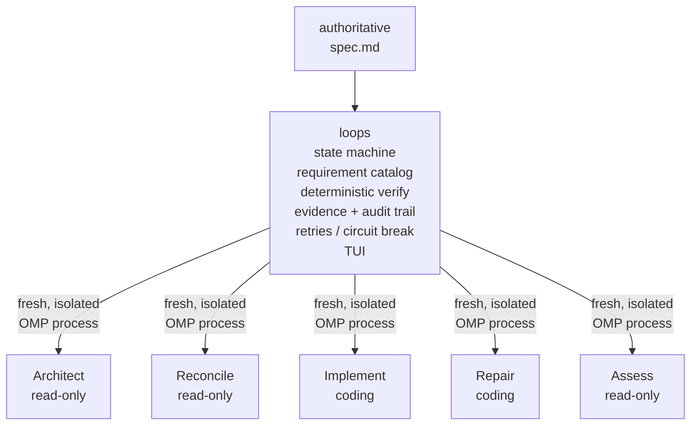

# loops

**A deterministic control loop for autonomous, spec-driven software development with coding agents.**

Give `loops` a spec and it will work toward satisfying it through isolated coding-agent workers, repository-backed state, deterministic verification, repair loops, and an independent final assessment.

The important distinction is this:

> **Agents do the work. The controller owns the process.**


`loops` is a small Rust controller for autonomous, spec-driven development.

It does not rely on one long-running agent conversation to remember the project, decide what to do next, modify the code, judge its own work, and eventually declare itself finished.

Instead, it runs a state machine that repeatedly:

1. inspects the repository against an authoritative specification,
2. selects one coherent next unit of work,
3. gives that work to a fresh coding-agent worker,
4. runs real build, test, lint, and project verification commands,
5. repairs deterministic failures when possible,
6. reconciles the repository against the spec again,
7. and requires an independent assessment before considering the run complete.

The default execution backend is **[Oh My Pi (OMP)](https://github.com/can1357/oh-my-pi)**, driven headlessly through `omp --mode rpc`.

> **`loops` is the orchestrator. OMP is the execution backend.**
> Workflow state, transitions, verification, retries, evidence, and completion rules are owned by the Rust controller rather than left entirely to the model.

---

## Status: MVP

`loops` is currently an **MVP**.

The core control loop is implemented and usable, including:

- spec-to-requirement analysis,
- repository reconciliation,
- isolated implementation workers,
- deterministic verification,
- repair loops,
- persistent state and evidence,
- stagnation and cycle limits,
- independent final assessment,
- per-role model and thinking configuration,
- configurable worker skills,
- TUI and non-interactive execution.

What has **not** been proven yet is more important:

`loops` does not yet have enough comparative evaluation to claim that this architecture is more reliable, cheaper, or more effective than strong single-agent workflows, Ralph-style loops, or other coding-agent orchestrators.

That is the main hypothesis this project now needs to test.

If you use `loops` today, treat it as experimental engineering tooling rather than a production-ready autonomous software factory.

---

## The idea in one picture



There is no permanent "master LLM" carrying the entire run in conversational memory.

State survives between workers through explicit artifacts:

- the repository,
- `spec.md`,
- `.loops/` controller state,
- the requirement catalog,
- work-unit summaries,
- reconciliation evidence,
- deterministic verification reports.

Each worker starts with fresh context.

That isolation is intentional.

The repository and controller state are durable. Agent context is disposable.

---

## The hypothesis

Long-running autonomous coding has a control problem as much as it has a model problem.

A single agent can be very effective at implementing a bounded task. Over longer runs, however, several failure modes become increasingly important:

- conversational context grows,
- assumptions become stale,
- earlier reasoning becomes hard to inspect,
- task plans diverge from repository reality,
- failed verification gets summarized instead of used directly,
- and the same agent that wrote the change is often asked to judge whether it succeeded.

`loops` experiments with a different structure.

### Disposable context, durable state

Architect, Reconcile, Implement, Repair, and Assess run in separate OMP processes with fresh context.

Workers do not inherit a long conversational history from previous workers.

What survives is explicit state written to disk.

This does not guarantee better results, but it makes dependencies between iterations more visible and reduces reliance on hidden conversational memory.

### Agents propose; deterministic code controls transitions

An agent saying "tests pass" is not enough.

`loops` runs actual processes and checks actual exit codes.

Builds, tests, linters, typecheckers, acceptance scripts, and other configured commands provide deterministic evidence used by the controller.

Deterministic verification is still only as good as the checks available in the project. A green test suite does **not** prove that the specification has been implemented correctly.

The goal is narrower:

> never substitute an agent's claim for evidence that the controller can obtain directly.

### Reconcile against the repository

After a verified change, `loops` does not blindly advance to the next item in an old plan.

A fresh Reconcile worker inspects the current repository against the full requirement catalog and decides what remains.

The roadmap is treated as a current interpretation of the repository, not as immutable truth.

### Independent assessment at the finish line

The worker that implemented the code does not certify overall completion.

When deterministic gates pass and reconciliation reports no remaining work, a fresh, read-only Assess worker evaluates the repository against the requirement catalog.

Assess is an additional skeptical check, not an oracle.

It is still a model and can still be wrong.

Its purpose is to reduce self-certification by separating implementation context from final evaluation.

### Fail closed

Invalid structured output, protected-file mutation, repeated stagnation, exhausted repair attempts, or failed deterministic gates block the run rather than silently converting uncertainty into success.

---

## What actually happens

A `loops run` is a hierarchy of loops rather than a linear generated task list:

```text
spec.md
   │
   ▼
ARCHITECT                 when the requirement catalog is missing/stale
   │
   ▼
┌──────────────────── PROJECT LOOP ─────────────────────┐
│                                                      │
│  RECONCILE                                           │
│      │                                               │
│      ├── gaps ──► IMPLEMENT ──► VERIFY               │
│      │                            │                   │
│      │                            ├─ PASS ─────┐      │
│      │                            │            │      │
│      │                            └─ FAIL      │      │
│      │                                │        │      │
│      │                             REPAIR       │      │
│      │                                │        │      │
│      │                             VERIFY       │      │
│      │                                │        │      │
│      └────────────────────────────────┴────────┘      │
│                                                      │
│          next cycle → inspect the repo again          │
└──────────────────────────────────────────────────────┘
   │
   │ reconciliation reports complete
   ▼
FINAL DETERMINISTIC GATES
   │
   ├── fail ──► REPAIR ──► verify again
   │
   ▼
ASSESS
   │
   ├── gaps ──► PROJECT LOOP
   │
   ▼
DONE
```

---

## The five roles

| Role          | Purpose                                                                         | Repo access     | Runs when                                                      |
| ------------- | ------------------------------------------------------------------------------- | --------------- | -------------------------------------------------------------- |
| **Architect** | Converts `spec.md` into a stable `REQ-NNN` requirement catalog                  | Read-only       | Initially and when the spec changes                            |
| **Reconcile** | Compares the repository against all requirements and selects the next work unit | Read-only       | At the beginning of every project cycle                        |
| **Implement** | Implements one bounded work unit                                                | Read/write/bash | Once per selected work unit                                    |
| **Repair**    | Responds to deterministic verification failures                                 | Read/write/bash | After verification fails                                       |
| **Assess**    | Independently evaluates final repository state against the requirements         | Read-only       | After reconciliation and deterministic gates report completion |

These are separate OS processes, not nested OMP subagents.

Each worker receives a deliberately limited environment:

```text
fresh OMP worker
    + role prompt
    + controlled skills
    + relevant work-unit context
    + repository
```

Workers currently execute **sequentially**.

That is deliberate.

Parallel execution introduces coordination, merge, dependency, and verification problems that are not solved by simply spawning more agents. Parallelism may be added later where work units can be shown to be sufficiently independent.

---

## Worker skills

`loops` creates an isolated per-worker skill environment under:

```text
.loops/runtime/<run>/<role>/skills
```

and mounts only explicitly allowed skills.

`--no-extensions` and `--no-rules` remain enabled so worker behavior does not silently depend on machine-specific OMP configuration.

`loops` ships role-procedure skills rather than language-specific expertise:

| Role                 | Built-in skill    |
| -------------------- | ----------------- |
| Architect, Reconcile | `spec-analysis`   |
| Implement            | `implementation`  |
| Repair               | `debugging`       |
| Assess               | `spec-assessment` |

A `code-review` skill is also included for a possible future Review role, but Review is not currently part of the state machine.

A **role prompt** defines worker identity, permissions, protected files, and the `loops_yield` contract.

A **built-in skill** describes the procedure expected from that role.

**User skills** can provide project, company, framework, language, or domain-specific expertise.

A **work unit** describes the concrete task.

The repository provides current reality.

### User-defined skills

Configure skills explicitly relative to the project root:

```toml
[skills]
shared = [
  ".loops/skills/project"
]

[skills.roles]
implement = [
  ".loops/skills/rust"
]

repair = [
  ".loops/skills/rust"
]
```

Every worker receives:

1. its built-in role skill,
2. configured shared skills,
3. configured role-specific skills.

Unconfigured global OMP skills, unrelated project skills, extensions, rules, and external capabilities are not implicitly inherited.

Invalid configured skill paths fail before the worker starts.

`loops` does not infer that a project needs a "Rust skill" because it sees `Cargo.toml`.

Worker expertise is explicit configuration.

Verification detection and worker skill selection are intentionally separate concerns.

---

## Structured completion, not prose parsing

Workers do not finish by printing a JSON block that the controller attempts to recover from free-form output.

Each worker receives a host-owned RPC tool:

```text
loops_yield
```

with role-specific structured output that the Rust controller can deserialize and validate.

Examples include:

- `ArchitectOutput`,
- `ReconcileResult`,
- `WorkerSummary`,
- assessment results.

A worker turn is not considered complete until it produces valid structured output through the expected contract.

If the worker fails to yield correctly after the configured reminders, the run treats that as a worker failure.

This does not make the model deterministic.

It makes the boundary between probabilistic model behavior and deterministic controller state explicit.

---

## Verification

`loops verify` and internal verification gates execute real project commands.

Auto-detection currently supports common workflows such as:

```bash
# Rust
cargo build
cargo fmt --check
cargo clippy --all-targets --all-features -- -D warnings
cargo test --all-targets

# Go
go test ./...

# Python
python -m pytest -q

# Node
test
typecheck
lint
build

# Git
git diff --check
```

The exact checks depend on detected project structure and available scripts.

Additional hard gates can be configured:

```toml
[verification]
commands = [
  "cargo test --all-features",
  "./scripts/acceptance.sh"
]
```

Every attempt — successful or failed — is persisted under:

```text
.loops/evidence/
```

including information such as:

- command,
- exit code,
- stdout,
- stderr.

### Verification has limits

Deterministic verification is one of the strongest parts of the control loop, but it should not be confused with proof of correctness.

An agent can produce software that passes the existing tests while still violating the intended behavior.

A weak project test suite produces weak evidence.

For serious autonomous delivery, projects should provide strong acceptance gates that reflect product behavior rather than only implementation health.

Useful examples include:

- integration tests,
- acceptance tests,
- contract tests,
- browser or UI checks,
- security scanners,
- architectural constraints,
- performance thresholds,
- project-specific validation scripts.

Improving verification quality is one of the most important directions for the project.

---

## Repair

A deterministic verification failure does not become "one more message" in the Implement worker's existing conversation.

Instead, `loops` starts a fresh Repair worker.

That worker receives the current repository plus the actual verification failure.

For example:

```text
repository after implementation
        +
actual failing command
        +
stdout / stderr
        +
exit code
        ↓
fresh Repair worker
```

Repair attempt #2 does not need Repair attempt #1's reasoning.

It sees the repository as Repair #1 left it and the newest deterministic evidence.

Repair is bounded by `max_repair_attempts`.

When attempts are exhausted, the run blocks rather than retrying indefinitely.

---

## Guardrails against runaway loops

Autonomous execution needs explicit stopping conditions.

`loops` currently includes:

### Protected-file snapshotting

Controller-owned files such as:

- `spec.md`,
- `.loops/config.toml`,
- `.loops/state.json`,
- and related state,

are protected around coding workers.

Unexpected modification can cause restoration and block the run.

This protects controller state from accidental mutation.

It is **not** a security sandbox.

### Stagnation detection

If Reconcile repeatedly proposes effectively the same work unit without requirement progress, a circuit breaker eventually trips.

Default:

```toml
stagnation_limit = 3
```

### Hard cycle ceiling

A project run cannot loop forever.

Default:

```toml
max_cycles = 25
```

### Repair ceiling

Repeated deterministic failures stop after a bounded number of repair attempts.

Default:

```toml
max_repair_attempts = 3
```

These limits exist to turn runaway behavior into an explicit blocked state instead of unlimited token and compute consumption.

---

## What `DONE` means

`DONE` is a controller state, not a sentence emitted by a coding agent.

Conceptually:

```text
status = done only when:

  1. a valid requirement catalog exists

  2. Reconcile reports every requirement satisfied
     and selects no next work unit

  3. final deterministic verification passes
     on the integrated repository

  4. a fresh read-only Assess worker independently
     reports no remaining requirement gaps

  5. configured Git cleanliness policy passes
```

> **Agent claims are hypotheses. Evidence determines controller transitions.**

Even then, `DONE` should be interpreted correctly:

it means the repository satisfied the evidence and assessment mechanisms currently available to `loops`.

It does not mean formal proof that the software is correct.

---

## TUI

`loops` owns the terminal while OMP workers execute headlessly in the background.

The Ratatui interface exposes three main views:

- **Run** — worker activity and requirement progress
- **Evidence** — requirement evidence and current gaps
- **Timeline** — state transitions, worker boundaries, and verification events

Keyboard controls:

```text
Tab                 switch view
Home / g            jump to top
Up / Down, j / k    scroll
End / G             follow live output
PageUp / PageDown   scroll faster
q / Ctrl-C          stop active run / exit when idle
```

When a run completes, the TUI remains available for inspection.

For CI and non-interactive environments:

```bash
loops run --no-tui
```

---

## Project state

Controller state is stored on disk and intended to remain human-inspectable.

```text
project/
├── spec.md
└── .loops/
    ├── config.toml
    ├── state.json
    ├── requirements.json
    ├── roadmap.json
    ├── evidence/
    └── runs/<run-id>/
        ├── events.jsonl
        ├── worker-events.jsonl
        └── transcript.log
```

### `spec.md`

The human-authored product contract.

### `requirements.json`

The Architect worker's normalized requirement catalog, tied to the current spec.

### `roadmap.json`

The latest reconciliation or assessment view of requirement status, evidence, and gaps.

### `state.json`

Controller state such as:

- phase,
- cycle,
- current work unit,
- completed work units,
- blocked/done status.

### `evidence/`

Deterministic verification reports.

### `runs/`

Per-run event streams and transcripts for inspection and debugging.

`resume` is deliberately equivalent to `run`.

Continuation is reconstructed from repository and `.loops/` state rather than from a preserved conversational session.

---

## Getting started

### Requirements

You need:

- a Rust toolchain to build `loops`,
- [Oh My Pi](https://github.com/can1357/oh-my-pi),
- authentication for at least one model supported by OMP,
- your project's own build/test tooling,
- Git, strongly recommended.

Install locally:

```bash
cargo install --path .
```

Verify dependencies:

```bash
loops --version
omp --version
```

Initialize a project:

```bash
cd your-project

loops init
```

This creates:

```text
spec.md
.loops/
```

Write the specification:

```bash
$EDITOR spec.md
```

Run:

```bash
loops run
```

Or without the TUI:

```bash
loops run --no-tui
```

Inspect controller state:

```bash
loops status --json
```

Run deterministic verification without invoking an LLM:

```bash
loops verify --json
```

---

## Configuration

Example `.loops/config.toml`:

```toml
#:schema https://raw.githubusercontent.com/flaviodelgrosso/loops/main/schemas/config.schema.json

version = 1
spec_file = "spec.md"

max_cycles = 25
max_repair_attempts = 3
stagnation_limit = 3

[agent]
command = "omp"
model = "openai/gpt-5.2"
thinking = "medium"
auto_approve = true
turn_timeout_secs = 900

read_only_tools = [
  "read",
  "grep",
  "glob"
]

coding_tools = [
  "read",
  "grep",
  "glob",
  "edit",
  "write",
  "bash"
]

extra_args = []

[agent.roles.architect]
thinking = "xhigh"

[agent.roles.implement]
model = "anthropic/claude-sonnet-4-5"
thinking = "medium"

[agent.roles.assess]
thinking = "xhigh"

[verification]
auto_detect = true
require_project_gate = true
commands = []
timeout_secs = 120
max_output_bytes = 65536

[git]
init = true
auto_commit = false
require_clean_tree = false
```

`agent.model` and `agent.thinking` provide defaults for the five model-backed roles:

- Architect,
- Reconcile,
- Implement,
- Repair,
- Assess.

A role can override either value:

```toml
[agent.roles.implement]
model = "anthropic/claude-sonnet-4-5"
thinking = "medium"
```

Values that are not overridden inherit the global agent configuration.

If neither global nor role-specific configuration selects a model, the fresh OMP process resolves its own default.

Verification is deterministic controller logic, not an agent role, so there is no:

```text
agent.roles.verify
```

---

## Schema-aware editor support

Generated `.loops/config.toml` files include:

```toml
#:schema https://raw.githubusercontent.com/flaviodelgrosso/loops/main/schemas/config.schema.json
```

Editors and language servers with TOML/JSON Schema integration can use the repository-hosted schema for:

- completion,
- hover documentation,
- validation,
- value suggestions.

Editors without schema support treat the directive as a normal comment.

---

## Safety: context isolation is not sandboxing

This distinction matters.

Fresh OMP processes provide **context isolation**.

They do **not** provide an operating-system security boundary.

Implement and Repair workers can receive real shell access.

With:

```toml
auto_approve = true
```

headless execution may run OMP with automatic tool approval so the worker does not block waiting for user interaction.

That is useful for autonomous execution and dangerous in an untrusted environment.

### Do not assume

- prompts are a filesystem boundary,
- tool allow-lists are equivalent to OS isolation,
- protected controller files prevent arbitrary shell behavior,
- fresh contexts prevent access to environment credentials,
- an autonomous worker cannot make destructive changes outside the intended repository.

### Recommended practice

Run autonomous workloads inside an environment whose blast radius you are prepared to accept.

Depending on the project, that may mean:

- an isolated container,
- a VM,
- a restricted development environment,
- a dedicated worktree,
- credentials with minimal privileges,
- controlled or disabled network access.

Protected-file snapshotting is designed to protect controller integrity from accidental changes.

It is not a replacement for real sandboxing.

---

## MVP boundaries

The current implementation intentionally leaves several problems unsolved.

Not implemented yet:

- parallel or fleet execution of independent work units,
- branch/worktree isolation per coding worker,
- cost and token accounting,
- coding-agent backends beyond OMP,
- OS-level sandbox management,
- remote worker execution,
- interactive steering of an in-flight worker,
- full production-grade policy and permission isolation.

Some of these may turn out not to belong in `loops` itself.

For example, sandboxing may be better handled by an execution environment around `loops` rather than deeply embedded into the orchestrator.

The controller already separates the execution backend through an `AgentBackend` abstraction, so additional coding-agent integrations should not require rewriting the core state machine.

---

## What still needs to be proven

This is currently the most important section of the project.

The architecture is implemented.

Its claimed advantages are **not yet sufficiently measured**.

The project needs comparative evaluation against simpler approaches.

A useful benchmark should hold the underlying model and task set as constant and compare approaches such as:

```text
A. single coding-agent session

B. simple retry / Ralph-style loop

C. loops
```

Across real software tasks.

Useful metrics include:

- requirement completion rate,
- hidden acceptance-test pass rate,
- deterministic gate pass rate,
- false-completion rate,
- regressions introduced,
- number of repair attempts,
- recovery rate after initial failure,
- human interventions,
- total tokens,
- cost per successful task,
- wall-clock time,
- behavior as task duration increases.

The most important question is not:

> Did an agent generate a plausible implementation?

It is:

> **Did the resulting repository independently satisfy the intended requirements without human correction?**

Until there is meaningful evidence here, statements that `loops` is more reliable, cheaper, or more effective than simpler agent workflows should be treated as hypotheses.

---

## Design principles

1. **The spec is authoritative.**
   Completing a generated task is not equivalent to satisfying the product requirement.

2. **Context is disposable.**
   Durable state should live in inspectable artifacts rather than depend entirely on an ever-growing conversation.

3. **Repository reality beats stale plans.**
   Reconcile again after verified changes instead of assuming the original task decomposition remains correct.

4. **LLMs propose; deterministic code controls transitions.**
   Models can reason and act without owning the workflow state machine.

5. **Use real failure evidence.**
   When verification fails, give Repair the actual failure rather than asking it to reconstruct one from a summary.

6. **Separate implementation from final assessment.**
   The worker that changed the repository should not be the only mechanism deciding whether the project is complete.

7. **Fail closed.**
   Invalid output, deterministic failures, unexpected controller-state mutation, stagnation, and exhausted retries should produce explicit failure states.

8. **Keep the controller understandable.**
   More agents and more orchestration are not automatically better.

9. **Measure before claiming superiority.**
   Architectural intuition is not a substitute for comparative evaluation.

---

## Why Rust?

The orchestration layer is deliberately boring.

It needs to:

- own state transitions,
- spawn and supervise processes,
- validate structured outputs,
- run deterministic commands,
- persist evidence,
- enforce bounded retries,
- restore protected state,
- and make failure conditions explicit.

Rust is a good fit for that kind of controller.

The intelligence remains in the workers.

The orchestration layer should aim to be predictable.

---

## Contributing

Contributions are genuinely welcome.

`loops` is early enough that challenging its assumptions is at least as valuable as adding features.

Areas where contributions would be particularly useful:

- evaluation harnesses,
- comparative benchmarks,
- adversarial test cases,
- hidden acceptance-test strategies,
- sandboxing approaches,
- worktree/container isolation,
- additional deterministic verification,
- real-world repository case studies,
- additional `AgentBackend` implementations,
- cost/token telemetry,
- stagnation and recovery analysis,
- documentation corrections,
- negative results.

If an architectural assumption looks wrong, open an issue.

If you find a case where a simpler loop consistently beats `loops`, document it.

If an agent can trick the completion mechanism, reproduce it.

If a requirement can be marked satisfied while the product is clearly wrong, that is valuable information.

The goal is not to defend the architecture.

The goal is to find out where it actually works.

---

## The bet

`loops` is intentionally small.

The hypothesis is not that adding more agents automatically produces better software.

It is that a deterministic controller around fresh, narrowly scoped coding agents can make long-running autonomous development more:

- observable,
- inspectable,
- recoverable,
- bounded,
- and verifiable.

Whether that structure also makes autonomous delivery **more reliable, more cost-effective, or more successful than simpler coding-agent loops remains to be demonstrated empirically.**

That is what this project is here to test.
